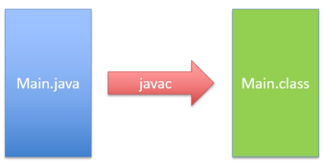
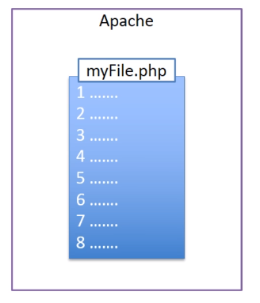

# What happened inside the JVM?

- Java file is compiled by compiler to .class file (bytecode file), and we can package these files into .jar or .war file.
- These bytecode files are run by JVM (Java Virtual Machine)
- JVM is `interpreting` the bytecode

-> And because of the JVM, we can write Java code once and run anywhere exists JVM

-> JVM does not only interpret code, but contains some complex algorithm to make it more efficiently.

## Tranditional interpreted languages

PHP is not compiled, but interpreted in the runtime

## Other JVM languages

- Kotlin
- Scala
- 