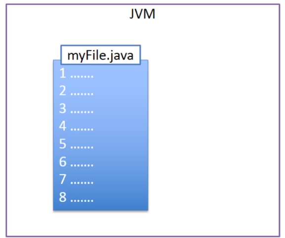
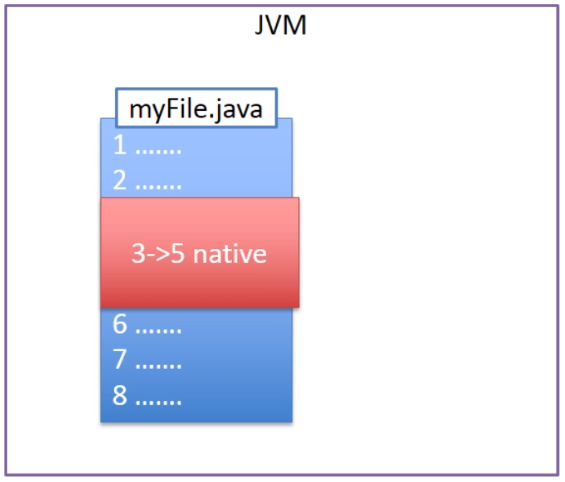
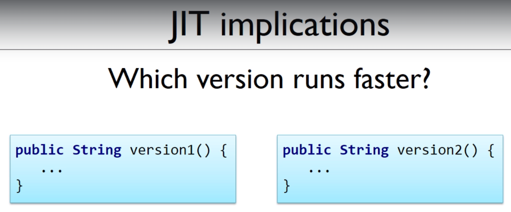

# The concept of "Just In Time Compilation"

JVM will also interpret bytecode line by line to machine code, which still seems to be slow compared to C.

Because C will compile code to native machine code directly, so the operating system can run it directly. We do not need additional software to interpret and run it.

The disadvantage of C is rather obvious : We are not able to write once and run it anywhere like Java.

And there is a compromise : Just In Time Compilation (JIT)

JVM will use idle time to monitor which branches of code are run the most frequently, and it will automatically decide to compile it to native machine code, so that part of code will run faster than other part.

If we run the above code in Windows, the red part will be compiled into native Windoes machine code; in Mac will be compiled into Mac machine code. They are different.

And this implies : `The longer you run your application, the faster it will run`

## Multi-thread process

The whole process of JIT is run on multi thread, so JIT compiling won't affect the running program.

If your application is highly consuming your CPU resource, you will see slightly lag because of JIT compilation, but it is totally worth it.

## Which version runs faster?

It is vague at this point, so we will discover more in the following course