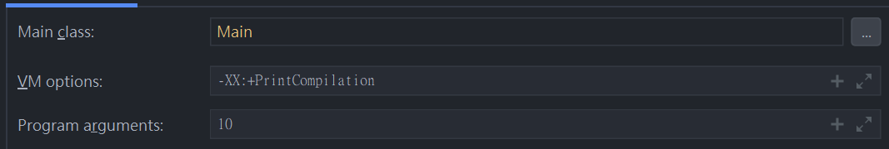

# Introducing the first example project

## Intellij

1. Copy `/Starting Workspaces/java8/Chapter 02/PerformanceExample1` to CH2 folder
2. Intellij : File -> Open -> select the above project
3. Configurations : Main class -> Main
4. Run it


## Running bytecode file with terminal

Once we have done running the Java file, there will appear a bin folder in our project, which consists compiled java file


We can run the following instruction

```
java Main 10
```

- Main means the name of the Main class
- 10 means the first program argument


## Arguments' Configuration

