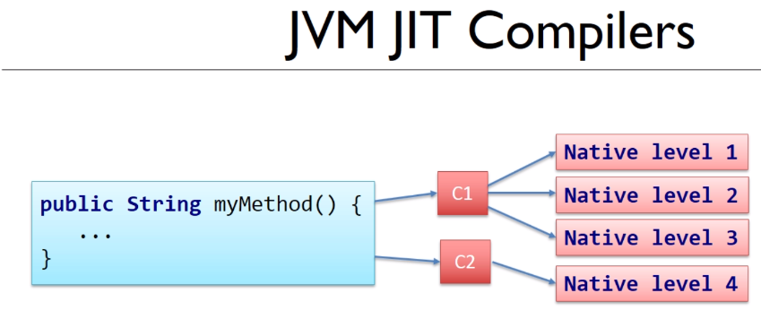
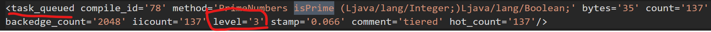
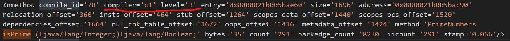
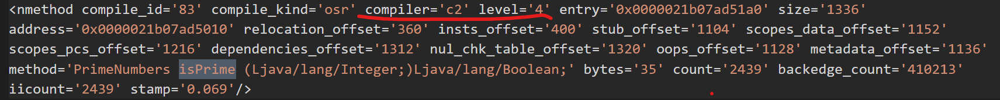

# The C1 and C2 Compilers and logging the compilation activity

There are 2 Java built-in compilers : C1 & C2



As we mentioned in the last sections, methods can be tagged compiling level

- level 1 - 3 : compiled by C1
- level 4 : compiled by C2

## Monitor all the process

```
java -XX:+UnlockDiagnosticVMOptions -XX:+LogCompilation Main 5000
```

This instruction will generate log file of the detailed process of compilation

[Example file](./PerformanceExample1/bin/hotspot_pid3644.log)

We can search 'isPrime', and we can see lots of it, because it was called for lots of times

In the beginning, the isPrime method is tagged as level 3, and it will be put into task queue, which means it will be compiled with C1



Then we can observe the compilation result




And because there are too many times to call this method, so JVM will put this method into task queue again, tagging it level 4

Then it will be compiled with C2

