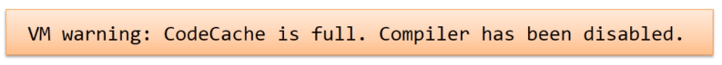
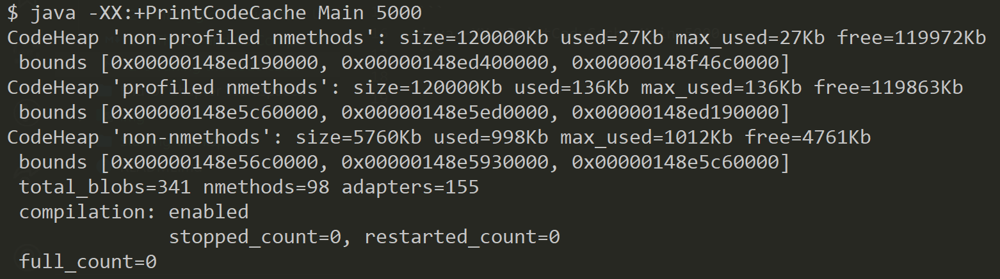
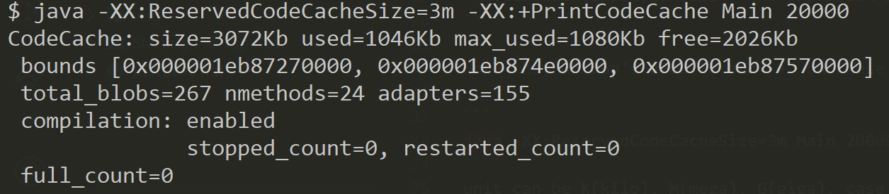

# Tuning the code cache size

As the previous secions mention, when a method is marked as level 4, it will be compiled by C2 and be placed into code cache.

But there is limited size of code cache.

In a large application, there may be numerous method to be place into code cache, so maybe they will be move in and out again and again.

And when the code cache is full, there will be a warning.



We can monitor the code cache by simply print it out

```
java -XX:+PrintCodeCache Main 5000
```




And we have 3 ways to change the code cache size

```
-XX:InitialCodeCacheSize – the initial code cache size, 160K default
-XX:ReservedCodeCacheSize – the default maximum size is 48MB
-XX:CodeCacheExpansionSize – the expansion size of the code cache, 32KB or 64KB
```

Note that we don't need to add `+` on these options. Instead, we need to specify the amount to it

```
java -XX:ReservedCodeCacheSize=3m Main 20000
```
unit can be K(kilo), M(mega), G(giga), case insensitive

