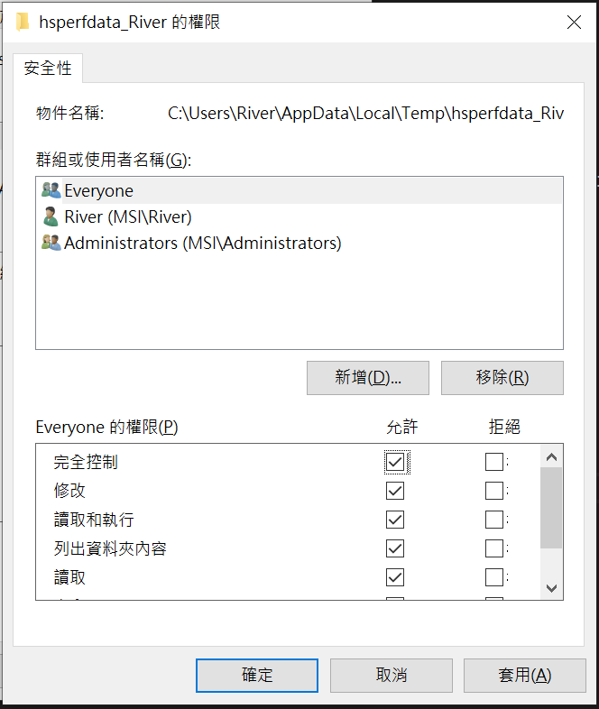
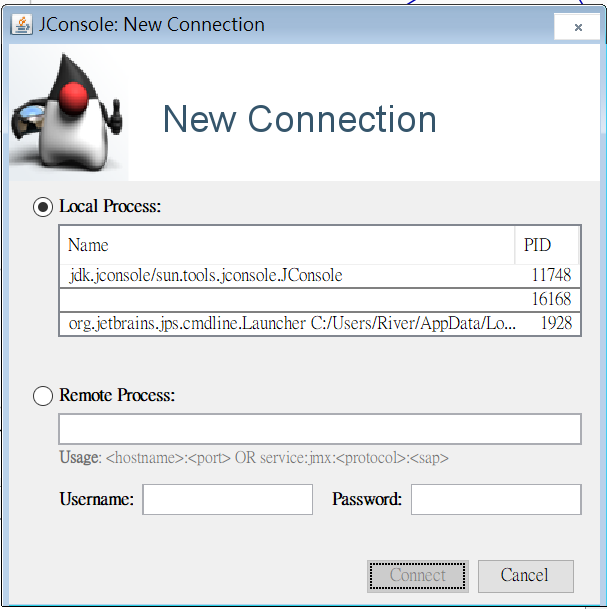
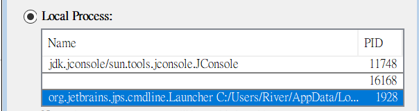
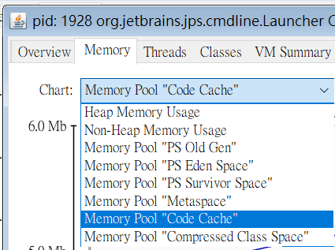
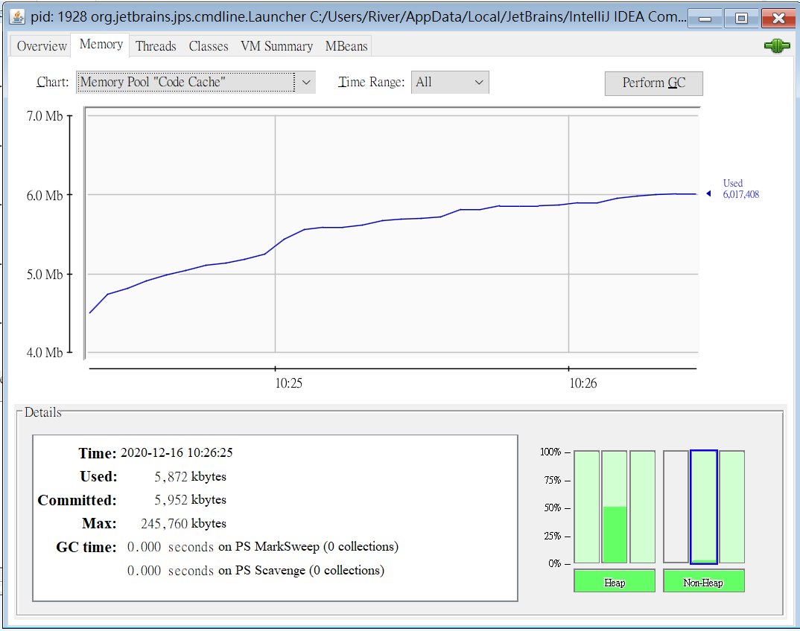
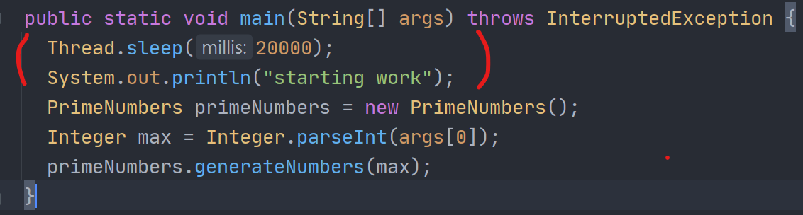
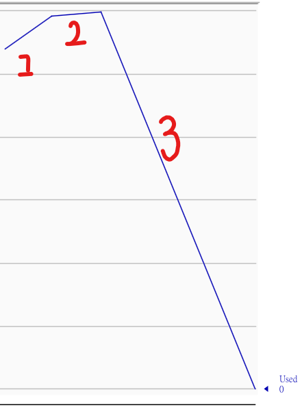

# Remotely monitoring the code cache with JConsole

## The way to open JConsole


Navigate to Java folder, usually here in Windows

```
C:\Program Files\Java\jdk-11.0.9\bin\jconsole.exe
```

If using Windows, you need to modify something about writing permissions

```
C:\Users\{UserName}\AppData\Local\Temp\hsperfdata_{UserName}
```

rightclick on the `hsperfdata` folder, and select property

security -> Everyone -> Edit -> Full control




## Monitor Code cache

Double click JConsole file, and there will be a window pop up



You can select Java process in local section

For example, we can connect to Intellij, cuz its based on Java.



After connecting to it, we can swtich the tab to Memory and select 'Memory pool code cache' option



And then we can observe code cache usage situation



## Test

We can add `Thread.sleep` to the Main method, and make it sleep for 20 seconds first



When we click start again, we can connect to the Main 5000



- The first phase is when we just started connecting to Main
- The second phase is when Thread ends sleeping and start to work
- The third phase is when the whole application finishes working

## JConsole monitoring also consumes CPU resource and code cache


