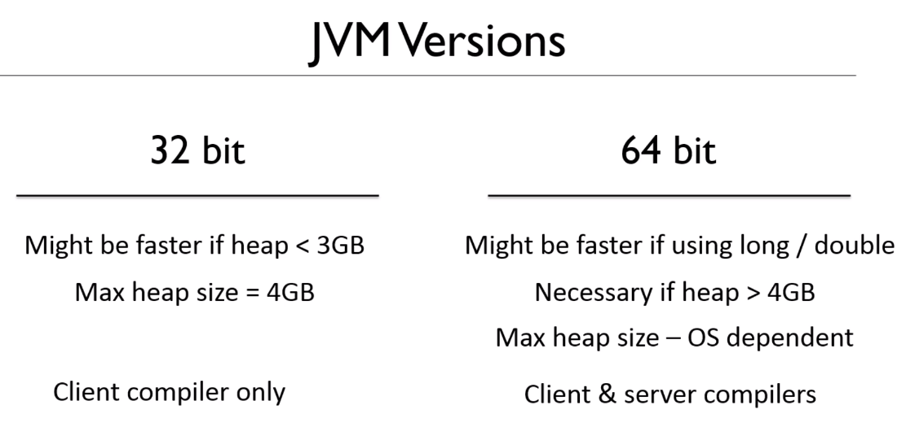

# The differences between the 32 bit and 64 bit JVM

- 32 bit operating system can only install 32 bit version JVM
- 64 bit operating system can install both 32 bit and 64 bit version JVM

Technically, 32 bit may be quicker than 64 bit, because the pointer to an object in memory is smaller, which is 32 bit instead of 64 bit.

So it is quicker to move the pointer.

However, the total memory of the application for Java 32 bit can not exceed 4 GB.

Also, some premitive 64 bit types like `double / long` can be run faster in 64 bit Java.

**Smaller Application perform better in 32 bit JVM**

## compiler

- 32 bit : Only C1 is available
- 64 bit : C1 and C2 are available

## In other word

- C1 compiler is also called `client` compiler
  - An app which lives in a short time such as running a small process
  - Startup time is more important
  - Because it will end very quickly, we don't need it optimized very deeply
- C2 compiler is also called `server` compiler
  - An app which lives for a long time such as web server
  - We rarely startup the app, and it will be existed overtime
  - So we need it to keep get optimized

