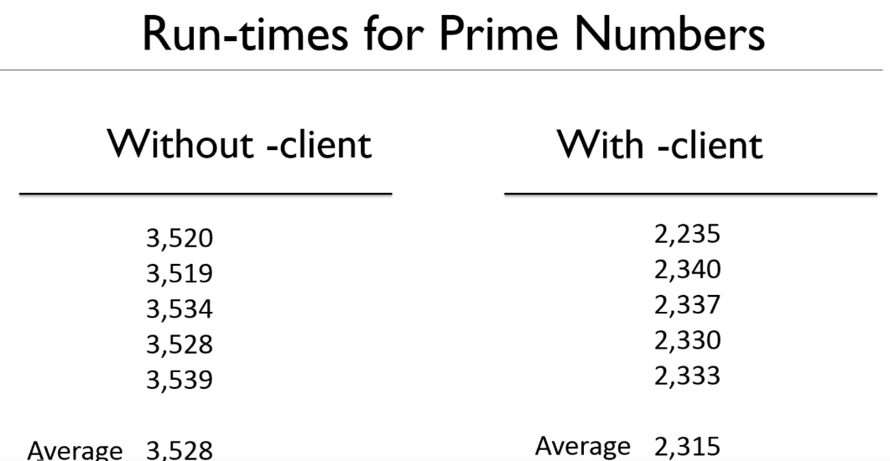

# Specifying which compiler to use at runtime

`-client` : It forces Java to run code wiht client mode, which means it will use client compiler only.

In some operating system, the C2 will still run, but it can still be quicker, for some analysis of code will be skipped.

```
java -client -XX:+PrintCompilation Main 25000
```

**In some operating system, this flag will be ignored**

For smaller app, it will run quicker.



But it is not for sure.


There are 2 more flags can be used:


- `-server` : 32 bit server mode
- `-d64` : 64 bit mode. If using it on 32 bit operating system, will get error, And in 64 bit will always use 64 bit, so this seems to be no use.

